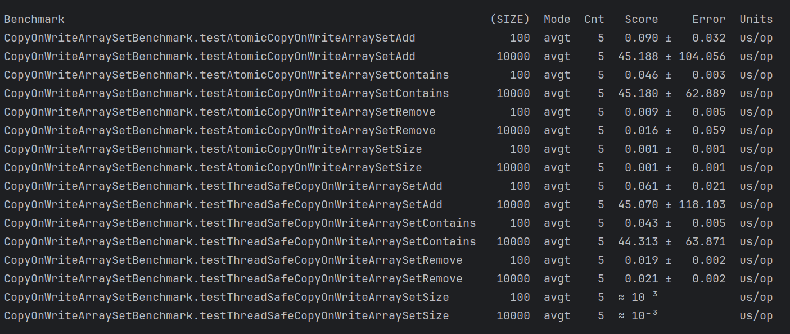
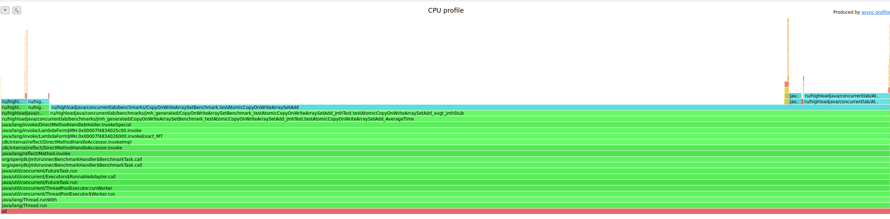
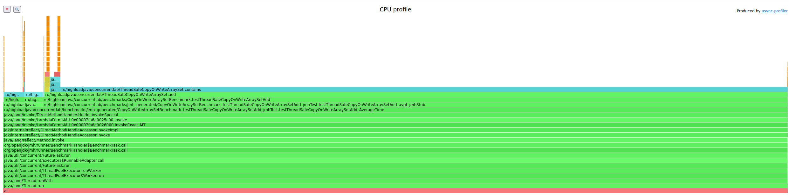
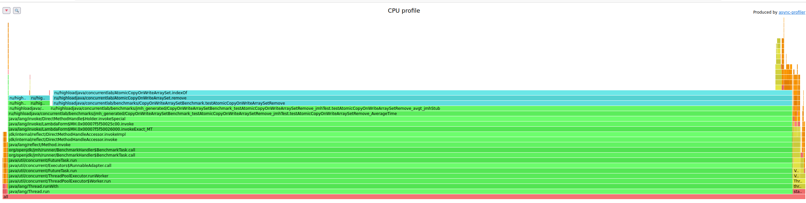
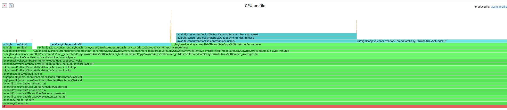
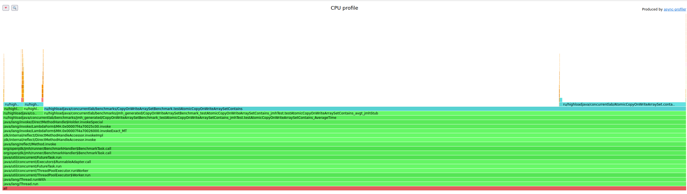
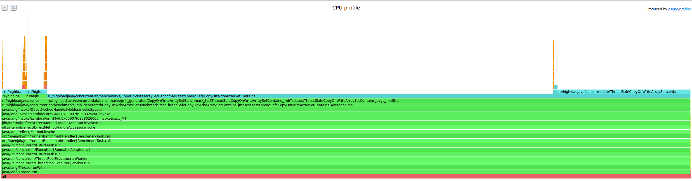
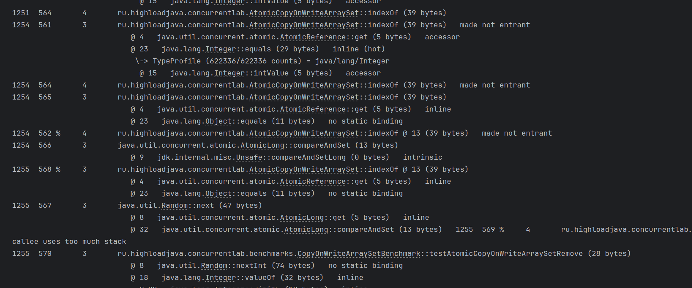
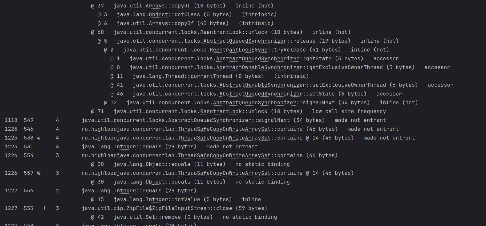

# Lab3 Concurrent Data Structure

В качестве задания была взята структура CopyOnWriteArraySet 
и имплементированы две реализации - через Atomic Reference (AtomicCopyOnWriteArraySet) и ReentrantLock (ThreadSafeCopyOnWriteArraySet)

Для каждой реализации был создан бенчмарк, осуществлено профилирование и продемонстрированы фрагменты JIT-компиляции

## Результаты бенчмарка

По результатам бенчмарка видно,что операции добавления, удаления, проверки наличия элементов происходит за сопоставимое время у обеих реализаций.

## Результаты профилирования

Операции добавления AtomicCopyOnWriteArraySet и ThreadSafeCopyOnWriteArraySet

Операции удаления AtomicCopyOnWriteArraySet и ThreadSafeCopyOnWriteArraySet

Операции проверки наличия элемента AtomicCopyOnWriteArraySet и ThreadSafeCopyOnWriteArraySet

## JIT-компиляция

В первом случае мы видим процесс работы реализации на Atomic

Во втором случае уже реализация на основе блокировок

